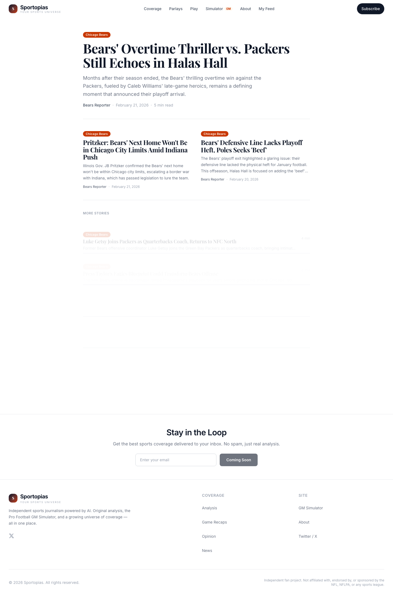
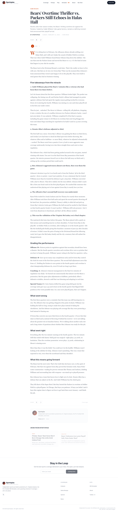
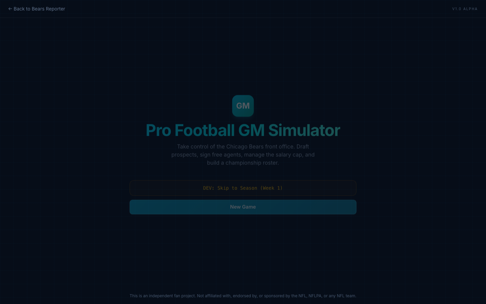
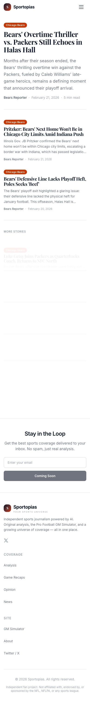

# Sportopias — AI-Powered Sports Journalism Platform

**[Visit Live Site](https://bears-reporter-site.vercel.app)**

A full-stack sports platform combining automated AI journalism, an interactive NFL GM simulator, and a 2D football practice game — built with Next.js 16, React 19, and TypeScript.

<p align="center">
  
</p>

---

## Features

### Coverage — Automated AI Journalism

An end-to-end content pipeline that discovers sports reporters, ingests news and tweets, selects trending topics, and generates original long-form articles — all without manual intervention.

<p align="center">
  
</p>

- **7-stage pipeline:** Discovery → Grounding → Web Scraping → Twitter Ingestion → Topic Selection → Generation → Publishing
- **Multi-provider LLM orchestration** — Gemini (free) for classification, OpenRouter for creative writing. Total cost: ~$0.004/article
- **Fact-checking feedback loop** — articles are validated against source material and regenerated if inaccuracies are found
- **Team-agnostic** — change one config file and the entire pipeline works for any NFL team
- **Zod-validated LLM responses** at every step — no raw JSON parsing

### Franchise — Pro Football GM Simulator

A client-side offseason simulation where you manage an NFL franchise through the full season cycle.

<p align="center">
  
</p>

- **16 game phases:** Staff → Free Agency → Draft → Minicamps → Training Camp → Preseason → Roster Cuts → Regular Season → Playoffs
- **Zustand state management** with 9 modular store slices and localStorage persistence
- **AI-powered scouting reports** generated via Gemini (zero cost)
- **Real data foundation** — 32 teams bootstrapped from actual 2025-26 rosters, contracts, and coaching staffs
- **Pure TypeScript engine** — all game logic separated from React, fully testable

### Practice Mode — 2D Football Game

A custom-built 2D football practice game with force-based physics, where you control the QB, throw to receivers, and run after the catch.

- **Custom physics engine** (F=ma, Euler integration) at 60fps — Canvas 2D rendering, no game framework
- **18 plays, 12 receiver routes, 5 defensive schemes** with man/zone coverage AI
- **Ball carrier mechanics:** Juke, spin, stiff-arm, truck — probabilistic tackle system
- **Hot routes, drive system, telemetry** — headless CLI for batch simulation

---

## Responsive Design

<p align="center">
  
</p>

---

## Technical Highlights

| Area | Details |
|------|---------|
| **Framework** | Next.js 16 (App Router), React 19, TypeScript |
| **Styling** | Tailwind CSS 4, CSS custom properties, responsive editorial design |
| **State** | Zustand with slice pattern (9 slices), localStorage persistence |
| **Content** | MDX articles via `next-mdx-remote`, JSON manifest, dynamic OG/JSON-LD |
| **AI/LLM** | Multi-provider (Gemini, OpenRouter), Zod schema validation, fact-check loop |
| **Game Engine** | Canvas 2D physics, Three.js + Rapier 3D (realtime mode) |
| **Testing** | Vitest |
| **Deploy** | Vercel, automatic CI/CD |

---

## Architecture

```
app/                        Next.js App Router
  articles/[slug]/          Dynamic MDX article rendering
  simulator/[saveId]/       GM simulator (16 subpages)
  practice/                 Full-viewport canvas game
  api/simulator/            AI scouting, narratives, evaluation

pipeline/                   Automated content generation
  discovery/                LLM-powered reporter/account discovery
  ingest/                   Web scraping + Twitter ingestion + podcasts
  generate/                 Topic selection + article generation + fact-check
  publish/                  MDX publishing + manifest updates

simulator/                  GM simulator
  engine/                   Pure TS game logic (draft, FA, trades, cap, staff, season)
  store/                    Zustand slices (9 modules)
  components/               Dark HUD-themed UI (60+ components)
  data/                     Bootstrap data, real NFL rosters + coaching staffs

practice/                   2D practice game
  engine/                   Physics, defender AI, ball carrier, game loop
  renderer.ts               Pure-function Canvas 2D rendering
  constants.ts              All physics tuning values
```

---

## Engineering Decisions

- **Team-agnostic pipeline** — All team data flows from a single config through `getTeamConfig()`. Change one file, pipeline works for any team.
- **Multi-provider LLM strategy** — Free tier (Gemini) handles 90% of calls. Paid models only for creative writing. Near-zero operational cost.
- **Separation of concerns** — Game engines are pure TypeScript with no React. UI consumes engine outputs. Everything is independently testable.
- **Type-driven development** — Shared types are single source of truth per subsystem (`pipeline/types.ts`, `simulator/types.ts`, `practice/types.ts`). Types update first, code follows.
- **No raw LLM parsing** — Every LLM response goes through Zod schema validation before use.

---

## Stack

`Next.js 16` · `React 19` · `TypeScript` · `Tailwind CSS 4` · `Zustand` · `MDX` · `Canvas 2D` · `Three.js` · `Rapier Physics` · `Vitest` · `Zod` · `Vercel`

---

*Source code is in a private repository.*

*Visit [bears-reporter-site.vercel.app](https://bears-reporter-site.vercel.app) to explore the live site.*
